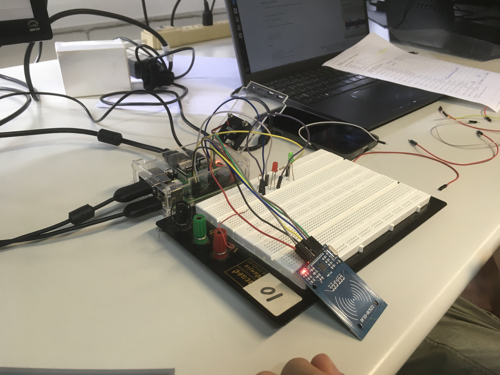
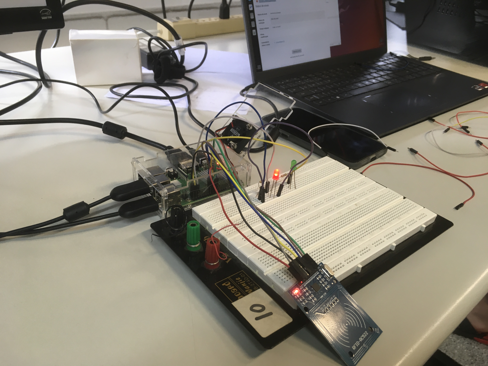
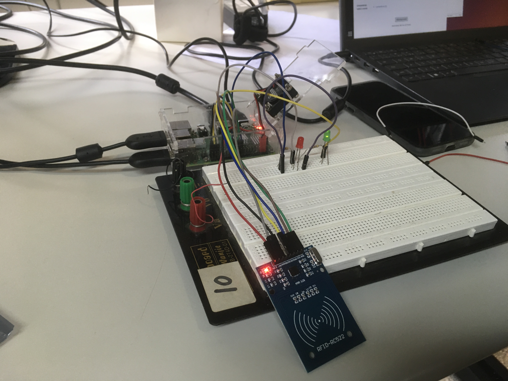

# SEL-0337
Neste projeto, foram desenvolvidos duas práticas visando o uso de dois periféricos de uma Raspiberry Pi: um módulo de câmera e umatag RFID e também o controle de versões de programa via Git/Github.

O propósito do projeto da câmera era criar um circuito no qual, quando o código identificasse um rosto à frente da câmera, o LED seria aceso, indicando acesso liberado para a pessoa. Enquanto não houvesse pessoas à frente da câmera, o LED permaneceria apagado, indicando acesso negado.

Para realizar o reconhecimento facial, foi utilizado o algoritmo haarcascade_frontalface_default. Ao detectar a presença de uma pessoa à frente da câmera, o sistema iniciava o processo de captura de fotos do rosto da pessoa, armazenando-as na pasta "detected_faces". Esse procedimento permitiria registrar a movimentação das pessoas naquele local, e as imagens seriam referenciadas com a data do evento da foto.
